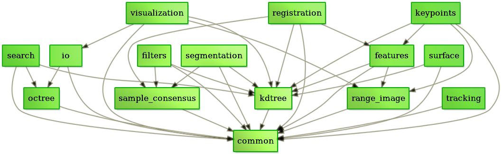

# PCL

== PCL(Point Cloud Library)

Nokta Bulutu Kütüphanesi ( PCL ), 2D / 3D görüntü ve nokta bulut işlemesi için bağımsız ve geniş çaplı, açık bir projedir. PCL, BSD lisansı şartları altında serbest bırakılır ve bu nedenle ticari ve araştırma amaçlı kullanım için ücretsizdir. Bu proje Filtreleme, özellik tahmini, yüzeyi yeniden yapılandırma, model uydurma ve segmentasyon gibi işlemleri yapabilen bir çok algoritma içerir. 

PCL, çapraz platform olup, Linux, MacOS, Windows ve Android / iOS üzerinde başarıyla derlenmiş ve konuşlandırılmıştır. Gelişimi basitleştirmek için, PCL ayrı olarak derlenebilen daha küçük kod kütüphanelerine ayrılmıştır. Bu sayede işlem karmaşıklıkları giderilmiş olur.  

.Image caption

== PCL kütüphanesi octree kodu çalıştırma

1) Herhangi bir klasörde bir dizin açıp onun olduğu klasöre gidiyoruz. 

2) Build klasörümüzü oluşturuyoruz.

[[source,linux5]]
----
mkdir build
----

3) içerisine .cpp, CMakeLists.txt ve .pcd dosyalarımızı atıyoruz.

* CMakeLists.txt'nin içeriği

[[source,linux5]]
----
cmake_minimum_required(VERSION 2.8 FATAL_ERROR)

project(cloud_viewer)

find_package(PCL 1.2 REQUIRED)

include_directories(${PCL_INCLUDE_DIRS})
link_directories(${PCL_LIBRARY_DIRS})
add_definitions(${PCL_DEFINITIONS})

add_executable (cloud_viewer cloud_viewer.cpp)
target_link_libraries (cloud_viewer ${PCL_LIBRARIES})
----

* cloud_viewer.cpp dosyasının içeriği

[[source,linux5]]
----
#include <pcl/visualization/cloud_viewer.h>
#include <iostream>
#include <pcl/io/io.h>
#include <pcl/io/pcd_io.h>
/////////////////////
#include <pcl/point_cloud.h>
#include <pcl/point_types.h>
#include <pcl/io/openni_grabber.h>
#include <pcl/visualization/cloud_viewer.h>

#include <pcl/compression/octree_pointcloud_compression.h>
#include <stdio.h>
#include <sstream>
#include <stdlib.h>

#include <pcl/octree/octree.h>
#include <vector>
#include <ctime>

using namespace std;
int user_data;

void viewerOneOff (pcl::visualization::PCLVisualizer& viewer)
{
    viewer.setBackgroundColor (1.0, 0.5, 1.0);
    pcl::PointXYZ o;
    o.x = 1.0;
    o.y = 0;
    o.z = 0;
    viewer.addSphere (o, 0.25, "sphere", 0);
    std::cout << "i only run once" << std::endl;

}

void viewerPsycho (pcl::visualization::PCLVisualizer& viewer)
{
    static unsigned count = 0;
    std::stringstream ss;
    ss << "Once per viewer loop: " << count++;
    viewer.removeShape ("text", 0);
    viewer.addText (ss.str(), 200, 300, "text", 0);

    //FIXME: possible race condition here:
    user_data++;
}

int
main ()
{

    bool showStatistics = true;
    pcl::io::OctreePointCloudCompression<pcl::PointXYZRGBA>* PointCloudEncoder;
    pcl::io::OctreePointCloudCompression<pcl::PointXYZRGBA>* PointCloudDecoder;

    pcl::io::compression_Profiles_e compressionProfile = pcl::io::LOW_RES_OFFLINE_COMPRESSION_WITH_COLOR;

    // instantiate point cloud compression for encoding and decoding
    PointCloudEncoder = new pcl::io::OctreePointCloudCompression<pcl::PointXYZRGBA> (compressionProfile, showStatistics);
    PointCloudDecoder = new pcl::io::OctreePointCloudCompression<pcl::PointXYZRGBA> ();

    pcl::PointCloud<pcl::PointXYZRGBA>::Ptr cloud (new pcl::PointCloud<pcl::PointXYZRGBA>);
    pcl::io::loadPCDFile ("/home/yapbenzet/Documents/Untitled Folder/samp23-utm-ground.pcd", *cloud);

    pcl::visualization::CloudViewer viewer("Cloud Viewer");

      std::stringstream compressedData;

      pcl::PointCloud<pcl::PointXYZRGBA>::Ptr cloudOut (new pcl::PointCloud<pcl::PointXYZRGBA> ());

// datayı sıkıştırmak için kullanılıyor.
      PointCloudEncoder->encodePointCloud (cloud, compressedData);

      PointCloudDecoder->decodePointCloud (compressedData, cloudOut);

// Octree için aşağıdaki yorum satırlarını aktif edip yukarıdaki 2 satırı yorum satırı yapmalıyız.

 /*float resolution = 128.0f;
      

 	 pcl::octree::OctreePointCloudSearch<pcl::PointXYZRGBA> octree (resolution);

 	 octree.setInputCloud (cloud);
 	 octree.addPointsFromInputCloud ();*/

viewer.showCloud (cloud);

    viewer.runOnVisualizationThreadOnce (viewerOneOff);

    viewer.runOnVisualizationThread (viewerPsycho);
    while (!viewer.wasStopped ())
    {
    	user_data++;
    }
    return 0;
}
----

4) Daha sonra cmake işlemini yapıyoruz.

[[source,linux5]]
----
cmake ..
----

5) Diğer adım

[[source,linux5]]
----
make
----

6) Diğer adım

[[source,linux5]]
----
./cloud_viewer
----

.Image caption
image::abi.png[I am the image alt text.]

== SIKIŞTIRMA ORANLARI

* model.pcd

.Image caption
image::model.png[I am the image alt text.]

* room_scan1.pcd

.Image caption
image::room_scan1.png[I am the image alt text.]

* samp23-utm-ground.pcd

.Image caption

* ism_test_cat.pcd 

.Image caption

